# Diagrama UML de Clases — PC5 Inventario Multialmacén

Sistema de Gestión y Valoración de Inventario Multialmacén (Java 17).

## Diagrama de clases (Mermaid)

```mermaid
classDiagram
    direction TB

    class Main {
        +main(String[] args) void
    }

    class MenuConsola {
        -InventarioService inventarioService
        -DemoService demoService
        -Scanner scanner
        +MenuConsola(InventarioService inventarioService)
        +iniciar() void
        -mostrarMenu() void
        -ejecutarReq01() void
        -ejecutarReq02() void
        -ejecutarReq03() void
        -ejecutarReq04() void
        -ejecutarReq05() void
        -ejecutarReq06() IOException
        -ejecutarReq07() IOException
        -ejecutarReq08() IOException
        -ejecutarReq09() IOException
        -ejecutarReq10() IOException
        -ejecutarReq11() IOException
        -ejecutarReq12() void
        -ejecutarReq13() void
        -ejecutarReq14() void
        -ejecutarReq15() void
        -ejecutarReq16() void
        -ejecutarReq17() IOException
        -ejecutarReq18() IOException
        -ejecutarReq19() IOException
        -ejecutarReq20() IOException
        -confirmarSalidaGuardando() void
        -leerTexto(String prompt) String
        -leerEntero(String prompt) int
        -leerDouble(String prompt) double
    }

    class InventarioService {
        +STOCK_MINIMO_ALERTA int
        -List~Producto~ productos
        -List~Almacen~ almacenes
        -ProductoRepository productoRepository
        -AlmacenRepository almacenRepository
        -MovimientoRepository movimientoRepository
        -ReporteRepository reporteRepository
        +registrarProducto(String, String, String, double) Producto
        +listarProductosActivos() List~Producto~
        +formatearTablaProductos(List~Producto~) String
        +actualizarPrecio(String, double) Producto
        +eliminarProductoLogico(String) Producto
        +registrarAlmacen(String, String, String) Almacen
        +guardarProductos() void
        +cargarProductos() int
        +registrarEntrada(String, String, int) Movimiento
        +registrarSalida(String, String, int) Movimiento
        +transferir(String, String, String, int) Movimiento
        +listarMovimientos() List~Movimiento~
        +formatearMovimientos(List~Movimiento~) String
        +calcularValoracionGlobal() Map
        +formatearValoracionGlobal() String
        +calcularValoracionPorAlmacen(String) Map
        +formatearValoracionPorAlmacen(String) String
        +detalleProductoConStock(String) String
        +buscarPorNombreParcial(String) List~Producto~
        +alertasStockMinimo() List
        +formatearAlertasStockMinimo() String
        +guardarAlmacenes() void
        +cargarAlmacenes() int
        +filtrarMovimientosPorFecha(String) List~Movimiento~
        +generarContenidoReporteValoracion() String
        +exportarReporteValoracion() void
        +cargarTodoAlIniciar() void
        +guardarTodo() void
        +limpiarMemoria() void
        +calcularStockGlobalPorProducto() Map~String,Integer~
        +buscarProducto(String) Optional~Producto~
        +buscarAlmacen(String) Optional~Almacen~
        +getProductos() List~Producto~
        +getAlmacenes() List~Almacen~
    }

    class DemoService {
        -InventarioService inventarioService
        -MovimientoRepository movimientoRepository
        +DemoService(InventarioService inventarioService)
        +ejecutarSemillaYDemo() void
        -prepararEntornoLimpio() void
        -encabezado(String, String) void
        -demoReq01() void
        -demoReq02() void
        -demoReq03() void
        -demoReq04() void
        -demoReq05() void
        -demoReq06() void
        -demoReq07() void
        -demoReq08() void
        -demoReq09() void
        -demoReq10() void
        -demoReq11() void
        -demoReq12() void
        -demoReq13() void
        -demoReq14() void
        -demoReq15() void
        -demoReq16() void
        -demoReq17() void
        -demoReq18() void
        -demoReq19() void
        -demoReq20() void
    }

    class Producto {
        -String codigo
        -String nombre
        -String categoria
        -double precioUnitario
        -boolean activo
        +Producto(String, String, String, double, boolean)
        +getCodigo() String
        +setCodigo(String) void
        +getNombre() String
        +setNombre(String) void
        +getCategoria() String
        +setCategoria(String) void
        +getPrecioUnitario() double
        +setPrecioUnitario(double) void
        +isActivo() boolean
        +setActivo(boolean) void
        +darDeBaja() void
        +equals(Object) boolean
        +hashCode() int
        +toString() String
    }

    class Almacen {
        -String idAlmacen
        -String nombre
        -String ubicacion
        -Map~String,Integer~ stocks
        +Almacen(String, String, String)
        +Almacen(String, String, String, Map)
        +getIdAlmacen() String
        +setIdAlmacen(String) void
        +getNombre() String
        +setNombre(String) void
        +getUbicacion() String
        +setUbicacion(String) void
        +getStocks() Map~String,Integer~
        +getStockProducto(String) int
        +setStockProducto(String, int) void
        +incrementarStock(String, int) void
        +decrementarStock(String, int) void
        +codificarStocks() String
        +decodificarStocks(String)$ Map~String,Integer~
        +equals(Object) boolean
        +hashCode() int
        +toString() String
    }

    class Movimiento {
        +FORMATO_FECHA_HORA DateTimeFormatter
        -LocalDateTime fechaHora
        -TipoMovimiento tipo
        -String codigoProducto
        -int cantidad
        -String idAlmacenOrigen
        -String idAlmacenDestino
        -String detalle
        +Movimiento(LocalDateTime, TipoMovimiento, String, int, String, String, String)
        +getFechaHora() LocalDateTime
        +getTipo() TipoMovimiento
        +getCodigoProducto() String
        +getCantidad() int
        +getIdAlmacenOrigen() String
        +getIdAlmacenDestino() String
        +getDetalle() String
        +getFechaSolo() String
        +aLineaArchivo() String
        +desdeLineaArchivo(String)$ Movimiento
        +toString() String
    }

    class TipoMovimiento {
        <<enumeration>>
        ENTRADA
        SALIDA
        TRANSFERENCIA
    }

    class ProductoRepository {
        -Path archivo
        +ProductoRepository()
        +ProductoRepository(Path)
        +guardar(List~Producto~) void
        +cargar() List~Producto~
        +getArchivo() Path
    }

    class AlmacenRepository {
        -Path archivo
        +AlmacenRepository()
        +AlmacenRepository(Path)
        +guardar(List~Almacen~) void
        +cargar() List~Almacen~
        +getArchivo() Path
    }

    class MovimientoRepository {
        -Path archivo
        +MovimientoRepository()
        +MovimientoRepository(Path)
        +append(Movimiento) void
        +sobrescribir(List~Movimiento~) void
        +cargarTodos() List~Movimiento~
        +filtrarPorFecha(String) List~Movimiento~
        +getArchivo() Path
    }

    class ReporteRepository {
        -Path archivo
        +ReporteRepository()
        +ReporteRepository(Path)
        +exportar(String) void
        +getArchivo() Path
    }

    class RutasDatos {
        +DIRECTORIO_DATA Path$
        +PRODUCTOS_CSV Path$
        +ALMACENES_CSV Path$
        +MOVIMIENTOS_TXT Path$
        +REPORTE_VALORACION_TXT Path$
        +asegurarDirectorioData()$ void
    }

    %% Relaciones de aplicación / UI
    Main --> MenuConsola : crea
    Main --> InventarioService : crea
    Main --> DemoService : crea (modo --demo)
    MenuConsola "1" --> "1" InventarioService : usa
    MenuConsola "1" --> "1" DemoService : usa
    DemoService "1" --> "1" InventarioService : usa
    DemoService "1" --> "1" MovimientoRepository : usa

    %% Relaciones de servicio con persistencia
    InventarioService "1" --> "1" ProductoRepository : usa
    InventarioService "1" --> "1" AlmacenRepository : usa
    InventarioService "1" --> "1" MovimientoRepository : usa
    InventarioService "1" --> "1" ReporteRepository : usa
    InventarioService "1" o-- "*" Producto : gestiona
    InventarioService "1" o-- "*" Almacen : gestiona

    %% Relaciones de dominio
    Almacen "1" o-- "*" Producto : stocks por codigo
    Movimiento "*" --> "1" TipoMovimiento : tipo
    Movimiento "*" --> "1" Producto : referencia codigo
    Movimiento "*" --> "0..2" Almacen : origen/destino

    %% Persistencia sobre rutas
    ProductoRepository ..> RutasDatos : usa
    AlmacenRepository ..> RutasDatos : usa
    MovimientoRepository ..> RutasDatos : usa
    ReporteRepository ..> RutasDatos : usa
```

## Multiplicidades resumen

| Relación | Multiplicidad | Descripción |
|----------|---------------|-------------|
| `InventarioService` — `Producto` | 1 a * | Un servicio gestiona muchos productos en memoria |
| `InventarioService` — `Almacen` | 1 a * | Un servicio gestiona muchos almacenes |
| `Almacen` — stock de `Producto` | 1 a * | Un almacén mantiene cantidades por código de producto |
| `Movimiento` — `TipoMovimiento` | * a 1 | Cada movimiento tiene un tipo |
| `Movimiento` — `Almacen` | * a 0..2 | Entrada/salida usan 1; transferencia usa 2 |
| `InventarioService` — repositorios | 1 a 1 | Un repositorio por tipo de archivo |

## Paquetes

| Paquete | Clases |
|---------|--------|
| `pe.upn.pc5.app` | `Main` |
| `pe.upn.pc5.ui` | `MenuConsola` |
| `pe.upn.pc5.model` | `Producto`, `Almacen`, `Movimiento`, `TipoMovimiento` |
| `pe.upn.pc5.service` | `InventarioService`, `DemoService` |
| `pe.upn.pc5.persistence` | `ProductoRepository`, `AlmacenRepository`, `MovimientoRepository`, `ReporteRepository`, `RutasDatos` |
