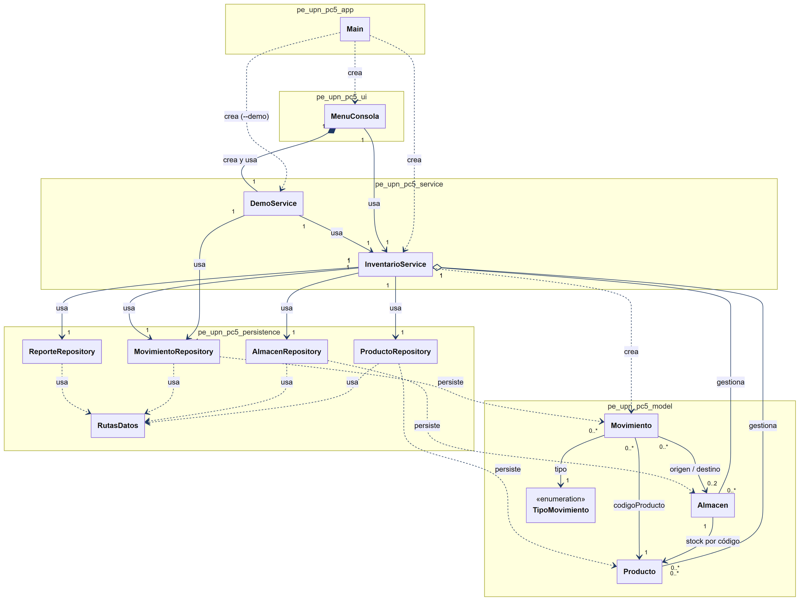
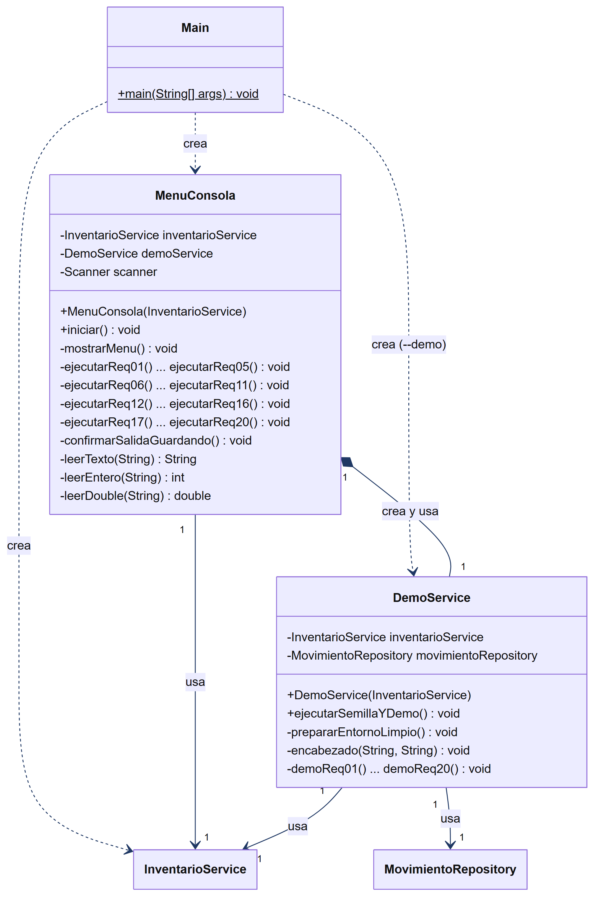
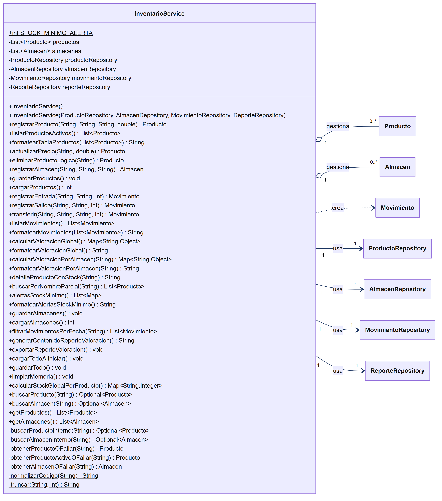
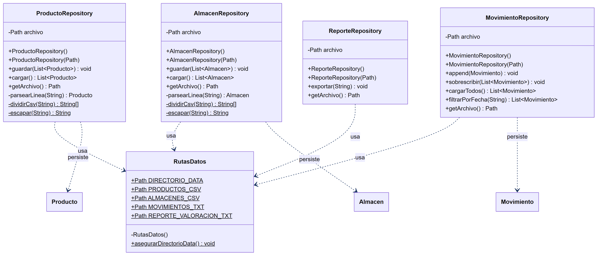
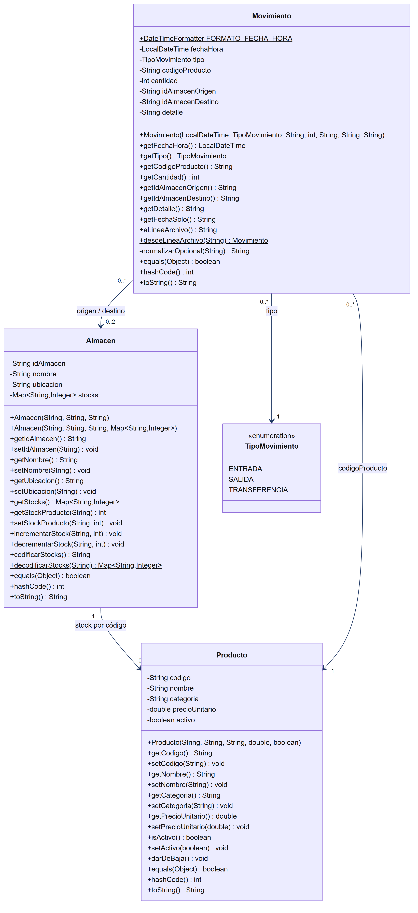

# Diagramas UML - PC5 Inventario Multialmacén

Diagramas de clases del Sistema de Gestión y Valoración de Inventario Multialmacén (Java 17), generados a partir del código fuente. Cada archivo lleva el mismo número de figura o anexo que tiene en el informe técnico de la PC5.

## Imágenes

Para revisar los diagramas basta con abrir los archivos `.png`. Están en alta resolución, así que se pueden ampliar sin perder nitidez.

| Archivo | En el informe | Contenido |
|---------|---------------|-----------|
| `Figura_1_UML_vista_general.png` | Figura 1 | Todas las clases agrupadas por paquete, con sus relaciones y multiplicidades |
| `Figura_2_UML_capa_aplicacion_interfaz.png` | Figura 2 | Main, MenuConsola y DemoService |
| `Figura_3_UML_capa_servicio.png` | Figura 3 | InventarioService |
| `Figura_4_UML_capa_persistencia.png` | Figura 4 | Repositorios y RutasDatos |
| `Figura_5_UML_capa_dominio.png` | Figura 5 | Producto, Almacen, Movimiento y TipoMovimiento |
| `Anexo_B_UML_completo.png` | Anexo B | Diagrama completo en una sola imagen |

### Figura 1. Vista general

### Figura 2. Capa de aplicación e interfaz

### Figura 3. Capa de servicio

### Figura 4. Capa de persistencia

### Figura 5. Capa de dominio

### Anexo B. Diagrama completo

## Código fuente de los diagramas

Las imágenes se generaron con [Mermaid](https://mermaid.js.org/). El código Mermaid del diagrama completo está en el Anexo A del informe técnico. Para volver a generar la imagen, basta con pegar ese código en https://mermaid.live y descargar el resultado como PNG.
